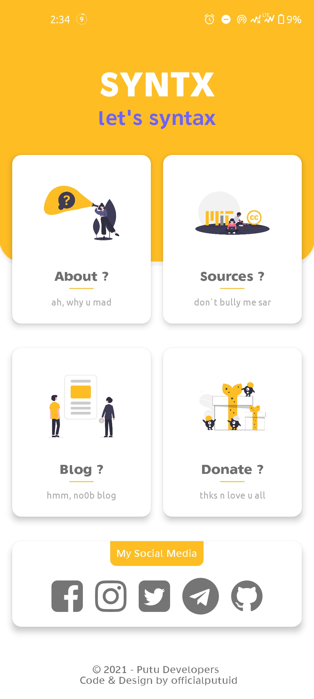
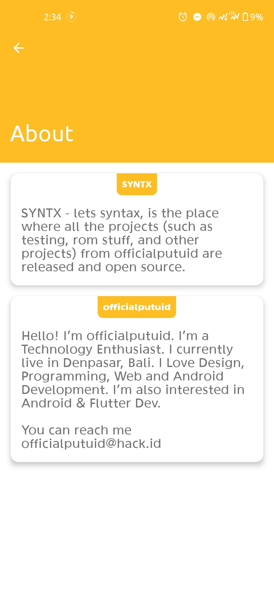
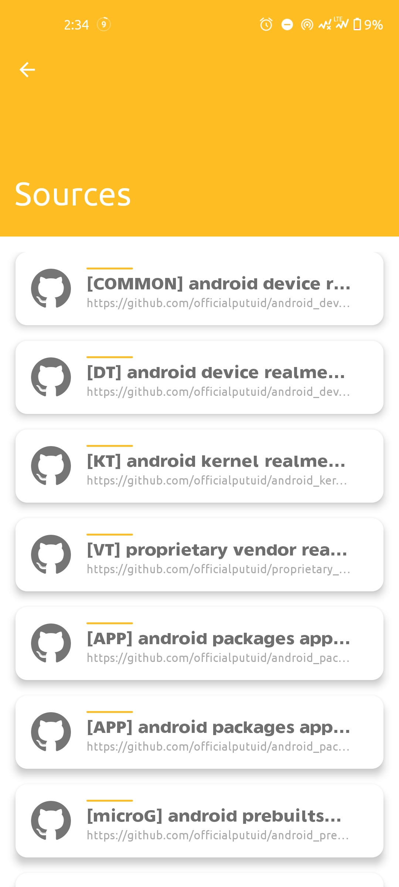
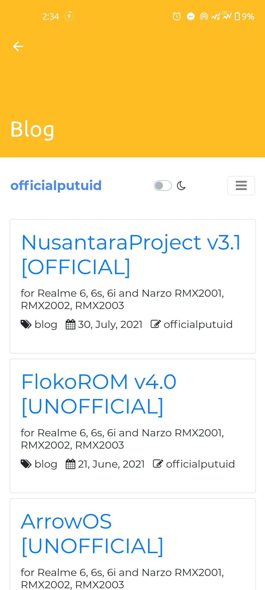

# SYNTX
SYNTX is Simple Personal App written in Java

## Features ##
About, Sources, Blog, and Donations with Google Ads

| | | |
|:-------------------------:|:-------------------------:|:-------------------------:|
||||
||

## Download ##
https://github.com/officialputuid/SYNTX111/blob/master/app/release/syntx-v1.1-stable-release.apk

## Credits ##
* SYNTX is licensed and distributed under **The GNU General Public License v3.0**.
* Code & Design by I Putu Jaya Adi Pranata (officialputuid)
